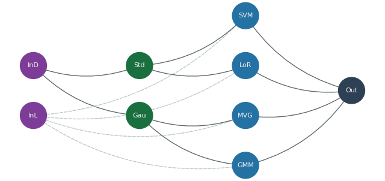

<div align="center">
  <h1>Machine Learning Put Together</h1>
  <div align="center"><p><i>Python implementations of few standard ML algorithms for classification, models evaluation and preprocessing.</i></p></div>
  <div align="center">
    <a href="https://www.python.org/"></a>
  </div>
</div>

## Prerequirements   
The following packages are used in this project:  
- **Matplotlib**
- **Networkx**  
- **Numpy**  
- **Scipy**  
- **Sklearn**  
  
## Folder Structure  
```  
src  
.  
│  
├── classifiers  
|   ├── __init__.py  
│   ├── gaussian_c.py  
│   ├── gmm.py  
│   ├── logistic_reg.py  
│   └── svm.py  
│  
├── examples  
|   └── iris  
|       ├── iris_data_util.py  
|       ├── iris_gaussian_c_example.py  
|       ├── iris_gaussian_c_example_graphs.py 
|       ├── iris_gmm_example.py  
|       ├── iris_gmm_example_graphs.py 
|       ├── iris_graphs_example.py  
|       ├── iris_logistic_reg_example.py 
|       ├── iris_logistic_reg_example_graphs.py  
|       ├── iris_preprocessing_example.py  
|       ├── iris_svm_example.py  
|       └── iris_svm_example_graphs.py   
│  
├── graphs  
|   ├── __init__.py  
|   ├── graphs.py  
│   └── grids.py
│ 
├── measuring_predictions  
|   ├── __init__.py  
│   └── measuring_predictions.py  
│  
├── plotting  
|   ├── __init__.py  
│   ├── printing.py  
│   └── plotting.py  
│  
├── preprocessing  
|   ├── __init__.py  
│   ├── gaussianization.py  
│   ├── lda.py  
│   ├── pca.py  
│   └── standard.py
│  
└── utils.py  
```  

## Graphs    
Useful tools to automate training and evalutation on multiple classifiers, preprocessing techinques and results elaboration.<br>
Graphs allow to display the internal structure of their nodes with *display* method.<br>
See **./src/examples/iris/iris_[classifier]_examples_graphs.py** for examples, the image below represent the internal structure of 
the graph directly from **iris_graphs_examples.py** *display* invocation.



## Classifiers  
- **Gaussian classifiers**:  
   - **Multivariate Gaussian classifier**  
   - **Naive Bayes Gaussian classifier**  
   - **Tied Covariance Gaussian classifier**  
- **Logistic Regression**  
- **Support Vector Machine**  
- **Gaussian Mixture Model**  
  
### Use
Each classifier is represented by a class.<br>  
The initialization of each classifier requires hyperparameters injection.  
Training data is in the form of a numpy matrix NxM (each row is an attribute, each column is a training sample).  
Labels are in the form of a numpy vector.<br>  
Invoke the classifier *"train"* method for training the model and setting the learning parameters.<br>  
Invoke the classifier *"transform"* method with the evaluation data set as parameter to compute the evaluation score   
(in the the form of log-likelihood, log-likelihood-ratio or others) for the models.<br>  
Use the returned evaluation score to compute the prediction.  
  
## Measuring Predictions (mostly for binary classifiers)
Measuring prediction of models and evaluating scores for different problems applications.  
  
## Plotting (and Printing)
Useful tools for plotting and printing results and comparing models by using measuring_predictions module.  
  
## Examples  
Based on dataset.  
### Iris  
Dataset at https://archive.ics.uci.edu/ml/datasets/iris.  
- **Gaussian classifiers examples**: Standard and graphs based application of Gaussian classifiers.  
- **Gaussian Mixture Model examples**: Standard and graphs based application of GMM classifiers.   
- **Logistic Regression examples**: Standard and graphs based application of logistic regression classifiers (2 classes split).  
- **Support Vector Machine examples**: Standard and graphs based application of SVM classifier (2 classes split).
  
## Author  
- *Francesco Cartelli* (https://github.com/francescocartelli)
