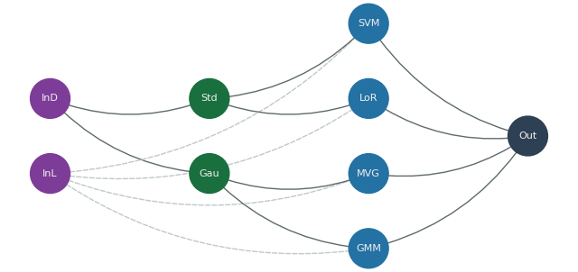

<div align="center">
  
  <h1>Machine Learning Put Together</h1>
  <p><i>Python implementations of standard ML algorithms for classification, models evaluation and preprocessing.</i></p>
   <a href="https://www.python.org/"></a>
</div>

## Prerequirements   
The following packages are used in this project:  
- **<a href="https://matplotlib.org/">Matplotlib</a>**
- **<a href="https://networkx.org/">Networkx</a>**  
- **<a href="https://numpy.org">Numpy**  
- **<a href="https://scipy.org/">Scipy</a>**  

<br>

## Getting Started
From the repo root directory:
- Get the modules required by launching:
```
pip install -r ./requirements.txt 
```
- Launch one example:
```
python3 -m examples.iris.iris_gaussian_example
```

<br>
  
## Folder Structure  
```  
.  
├── examples                                 # All examples are here  
|   ├── iris                                 # Iris dataset examples
|   |   └── data
|   |
│   └── wines                                # Wines dataset examples
|       └── data
|
├── images                                   # Repo images
|
└── src                                      # Source code directory
    ├── classifiers                          # Classifiers
    │   
    ├── graphs                               # Graphs
    │ 
    ├── measuring_predictions                # Prediction exaluation
    │  
    ├── plotting                             # Plotting
    │  
    ├── preprocessing                        # Preprocessing
    │  
    └── utils.py  
```  

## Graphs    
Useful tools to automate training and evalutation on multiple classifiers, preprocessing techinques and results elaboration.<br>
Graphs allow to display the internal structure of their nodes with *display* method.<br>
See the a complete iris example <a href="https://github.com/francescocartelli/machine-learning-put-together/blob/master/examples/iris/iris_graphs_example.py">here</a>.

<div align="center">

</div>

<br>

## Classifiers  
- **Gaussian classifiers**:  
   - **Multivariate Gaussian classifier**  
   - **Naive Bayes Gaussian classifier**  
   - **Tied Covariance Gaussian classifier**  
- **Logistic Regression**  
- **Support Vector Machine**  
   - **Linear SVM**
   - **Quadratic Kernel SVM**
   - **Radial Basis Kernel SVM**
- **Gaussian Mixture Model**  

<br>
  
### Usage
Training data is in the form of a matrix NxM (each row is an attribute, each column is a training sample).
Labels are in the form of a numpy vector.<br>  
Invoke the classifier *"train"* method for training the model and setting the learning parameters. 
Invoke the classifier *"transform"* method with the evaluation data set as parameter to compute the evaluation score   
(in the the form of log-likelihood, log-likelihood-ratio or others) for the models.<br>  
Use the returned evaluation score to compute the prediction.

<br>
  
## Examples  
Available <a href="https://github.com/francescocartelli/machine-learning-put-together/tree/master/examples">here</a>, divided by dataset:
### <a href="https://github.com/francescocartelli/machine-learning-put-together/tree/master/examples/iris">Iris</a>  
Dataset at https://archive.ics.uci.edu/ml/datasets/iris.  
- **Gaussian classifiers examples**: Standard and graphs application of Gaussian classifiers.  
- **Gaussian Mixture Model examples**: Standard and graphs application of GMM classifiers.   
- **Logistic Regression examples**: Standard and graphs application of logistic regression classifiers (2 classes split).  
- **Support Vector Machine examples**: Standard and graphs application of SVM classifier (2 classes split).

### <a href="https://github.com/francescocartelli/machine-learning-put-together/tree/master/examples/wines">Wines</a>
-  **Wines graph examples**: Model ensable for all the models (MVG, SVM Poly, SVM RBF and GMM) recalibrated by Logistic Regression with graph application.

<br>

## Author  
- **<a href="https://github.com/francescocartelli">Francesco Cartelli</a>**
